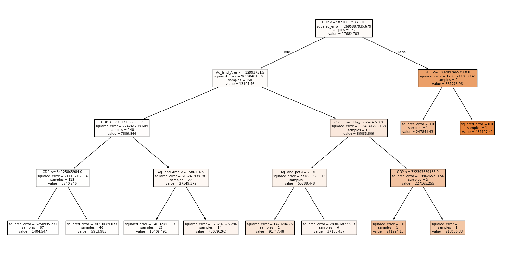

## Project 4: Predicting Pesticide for Countries in 2020

https://github.com/Owenneal1/Pesticide-use-predictor.- 

### Introduction and Cleaning the Data

This project is an attempt to better understand the relationship between pesticide use and other economic variables, as well as predict pesticide use based on those variables. This project got its data from the world bank and includes, pesticide use by country and region, GDP, percentage of GDP that is in ag/fishing/forestry, percent of country's land used in agricultural land, yield of cereals in kg/ha, and land devoted to cereals in ha. I merged this data frame and kept the countries that had values for all the data. First I sorted and cleaned each individual csv, had the variable of interest be the 2020 entry of each country, and finally, I merged them into one df based on their country 3 letter ID. I then added in the countries name based on an index I created with the names and abbreviation and finally made the df into the csv: merged_data.csv.

### First Batch of results. 

Fig 1: Visualized decision tree with a max depth of 4

R^2 Score: 0.47625238439053863

This is the R^2 for that specific decision tree regression. There are 13 variables of interest in the test pool. I landed on 13 because it is large enough where it can capture some - even a small - amount of variation between countries and hopefully come up with a regression that will work for the prediction. Even after finding a sweet spot in the teens for the number of items in the testing pool - too large and too small produced negative or extremely small R^2 - meaning I either overfit the data or the parameters/regression is flawed. I replaced this section in the code with the third batch and didn't see a reason to switch it back because batch 3 is better.

### Second Batch

I adjusted the depth to 7 resulting in: 
R^2 Score: 0.4751464924946913

Then boosting it up to 9: 

R^2 Score: 0.4752427632160464 

There is not a large difference in the numbers, so I think that the problem is using only one tree. 

### Third Batch 

I discovered an error in my code. I had floats for my dataset, but I was still using the regular integer input for the test_size parameters.

So I changed it to .2 (20%), and made the depth to 8 finding the R^2 to be:
R^2 Score: 0.5469712235417736
Not perfect but at least it’s above 50%.

### Fourth Batch: The Decision Forest

I decided to run a random forest because it be able to run more predictions on the data set than just one tree.

I started with a test_size of .2 = 20%, a max_depth of 4, and a number of generated trees at 1500. My model arrived at an R^2 of 0.370 and with n=150 almost the same R^2 at 0.370. Nothing seemed to be able to make the r^2 better. 

It was strange that after playing around with the parameters I was hitting a wall with all trials. So this led me to believe that there may have been something wrong with the data. 
I believe that the different data collections I pulled from varied in the way they collected the data and how the specific data points (GDP, Ag land, etc.) were measured. By this I mean that there were some countries that the World Bank probably had a very diffcult time with estimating their pesticide use or GDP use. 

I analyzed the data and realized there was one data point that had pesticide use in the 700,000 tonnes. I don't think this was a data collection error, but one on my end. I assume this was a regional data point like North America or Sub Sahara Africa that got through, so I dropped this point. It didn't fit with the rest of the data I was trying to analyze. Instantly the R^2 jumped to 0.5178 without changing any of the parameters. Changing the depth to 6 I got an R^2 of 0.549. 

When reevaluating the data I realized there were very small island nations and countries in the data set. I think that these countries especially the ones with a small amount of agricultural land differ in form and practice than larger countries, especially countries like USA, Russia, China, and India which have much larger land masses and larger economies of scale. The specialization and efficiency of the American agriculture industry is going to dwarf nations like Sao Tome and Principe or Hong Kong (it is funny a city state made it through and their pesticide use isn't 0. I assume they use pesticides for gardens/ornamentals/insects). So introduced another filter that if farm land was below <2000 ha (a very conservative filter that only removed the smallest nations) those data points would be omitted. 

With a max depth of 6 and n_estimators at 1000 and test size of 0.2, I got an R^2 of 0.706. This was raised to 0.8379961967151955 as I changed the test_size to 0.11. Making the percent of the test group smaller led to a larger training cohort. Making it too small can lead to overfitting, but I am not worried as I could just fall back on the 70% accurate predictor.

### Conclusion 

I was able to make a model using the random forest that predicted pesticide use at ~84% accuracy. I think that this is high enough for what I am trying to find. As stated earlier, a problem with the predictor may be the data and the question itself that I am trying to solve. Pesticide use across the entire world has many variables that are totally unaccounted for here. You could view them as hidden variables in the dataset that are different for each country but still affect those countries and others, this may include war, regulation, cultural approaches to farming - the list goes on. I think that this opens more questions about small nations/developing nations and how they farm compared to the developed world. I think that an additional question that can be looked into is farming and pesticide use in the United States. Looking at the acreage devoted to farming per county - average size of farms per county- average number of farms per county - average fertilizer use - yield - can all be useful metrics to consider. These are just a few variables, but the more you add the more your prediction can look like the actual pesticide use. When adding actual pesticide use (The US probably has the most accurate data besides maybe the EU) some interesting things you can do with the data is use it to predict health outcomes - or pollution - you can look at Nitrate concentrations (caused by N-fertilizers) because of the high correlation between the 2, or you can look at early onset Alzheimer’s. You can even see how certain pesticides like Neonicotinoids effects honey making for apiaries in the county/town. 

Overall, there is a lot to gleam from the world data for predicting pesticide use and even more variables to control for. Perhaps predicting pesticide use can aid a country by seeing metrics that other countries with low pesticides employ and how that country can use it to lower their pesticide footprint. 